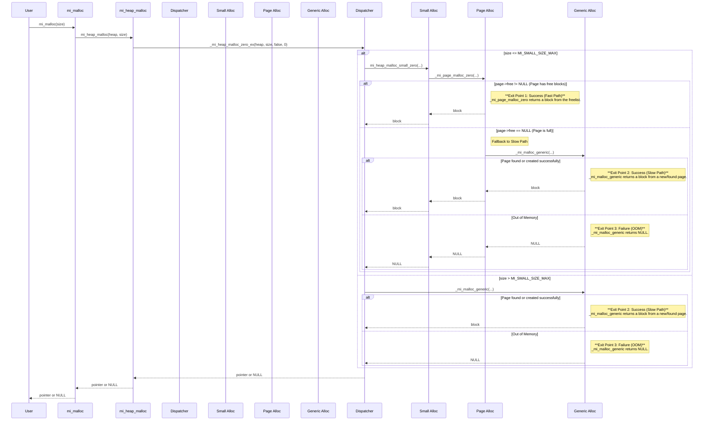

### `mi_malloc` In-Depth: Tracing the Final Exit Points (Revised)

This revised analysis details the step-by-step execution flow of `mi_malloc`, with a specific focus on identifying the three primary "exit points" within the internal call stack. These are the functions where a memory address is either successfully allocated or where an allocation failure (`NULL`) originates, before propagating back up to the application.

### 1. Visual Overview with Function Names

#### 1.1. Execution Sequence Diagram with Explicit Function Calls and Exit Points

This sequence diagram illustrates the temporal flow, detailing the specific functions called in each path and highlighting the three distinct scenarios and their originating functions.



#### 1.2. Logical Flowchart with Explicit Function Calls and Exit Points

This flowchart illustrates the decision-making process and function calls within `mi_malloc` that lead to one of the three final outcomes.

```mermaid
flowchart TD
    subgraph Legend
        direction LR
        Success1[Exit Point 1: Fast Path Success]
        Success2[Exit Point 2: Slow Path Success]
        Failure3[Exit Point 3: OOM Failure]
    end
    style Success1 fill:#d4edda,stroke:#155724
    style Success2 fill:#d1ecf1,stroke:#0c5460
    style Failure3 fill:#f8d7da,stroke:#721c24

    A[start: mi_malloc] --> B["_mi_heap_malloc_zero_ex (Dispatcher)"]
    B --> C{size <= MI_SMALL_SIZE_MAX?}
    
    C -- Yes --> D["mi_heap_malloc_small_zero"]
    D --> E["_mi_page_malloc_zero"]
    E --> F{Page has free blocks?<br>(page->free != NULL)}
    F -- Yes --> Success1
    
    C -- No --> G["_mi_malloc_generic (Slow Path)"]
    F -- No --> G

    G --> H{"mi_find_page / mi_page_fresh:<br>Find or create a page?"}
    H -- Yes --> I["_mi_page_malloc_zero:<br>Allocate block from page"] --> Success2
    H -- No --> Failure3

    Success1 --> Z[Return Pointer to User]
    Success2 --> Z
    Failure3 --> Y[Return NULL to User]
```

### 2. Execution Flow and Exit Point Analysis

The journey of an allocation request begins at the API layer and drills down into the heap implementation. The final return value originates from one of two key internal functions.

#### Step 1: API Entry Point & Dispatch

The initial calls (`mi_malloc` -> `mi_heap_malloc` -> `_mi_heap_malloc_zero_ex`) act as wrappers that lead to the main dispatcher.

```cpp
// File: src/alloc.c

extern inline void* _mi_heap_malloc_zero_ex(mi_heap_t* heap, size_t size, bool zero, size_t huge_alignment) mi_attr_noexcept {
  // fast path for small objects
  if mi_likely(size <= MI_SMALL_SIZE_MAX) {
    return mi_heap_malloc_small_zero(heap, size, zero);
  }
  else {
    // regular allocation (slow path)
    void* const p = _mi_malloc_generic(heap, size + MI_PADDING_SIZE, zero, huge_alignment);
    // ...
    return p;
  }
}
```
**Explanation:**
This function is the critical dispatcher. It checks the allocation `size` and directs control to either the fast path (`mi_heap_malloc_small_zero`) or the slow path (`_mi_malloc_generic`). The value returned by one of these two paths is what ultimately gets returned to the application.

---

#### Exit Point 1: Fast Path Success

This is the most common and highly optimized scenario for small allocations.

```cpp
// File: src/alloc.c

extern inline void* _mi_page_malloc_zero(mi_heap_t* heap, mi_page_t* page, size_t size, bool zero) mi_attr_noexcept
{
  // ... (asserts) ...

  // check the free list
  mi_block_t* const block = page->free;
  if mi_unlikely(block == NULL) {
    // Fallback to slow path if page is full
    return _mi_malloc_generic(heap, size, zero, 0);
  }
  
  // pop from the free list
  page->free = mi_block_next(page, block);
  page->used++;
  
  // ... (perform zeroing, padding, and stats updates) ...

  return block; // ★★★ EXIT POINT 1: SUCCESS (FAST PATH) ★★★
}
```
**Explanation:**
When a small allocation is requested and the corresponding page has available blocks in its freelist (`page->free != NULL`), this function executes.

*   **Originating Function:** `_mi_page_malloc_zero`
*   **Action:** It pops a `block` from the head of the page's freelist, updates page metadata, and performs necessary setup.
*   **Return:** It returns the `block` pointer. This value propagates up through `mi_heap_malloc_small_zero`, `_mi_heap_malloc_zero_ex`, and finally `mi_malloc` to the application.

---

#### Exit Point 2: Slow Path Success

This path is taken for large allocations or when the fast path fails (i.e., the target page is full).

```cpp
// File: src/page.c

void* _mi_malloc_generic(mi_heap_t* heap, size_t size, bool zero, size_t huge_alignment) mi_attr_noexcept
{
  // ... (housekeeping: deferred free, collection) ...

  // find (or allocate) a page of the right size
  mi_page_t* page = mi_find_page(heap, size, huge_alignment);
  if mi_unlikely(page == NULL) { 
    mi_heap_collect(heap, true /* force? */);
    page = mi_find_page(heap, size, huge_alignment);
  }

  if mi_unlikely(page == NULL) { 
    // ... (error message) ...
    return NULL; // This would be Exit Point 3
  }

  // ... (asserts that a page was successfully acquired) ...
  
  // At this point, `page` is guaranteed to have free blocks.
  // This call will now succeed without recursing further.
  void* p = _mi_page_malloc_zero(heap, page, size, zero);
  
  // ... (handle full pages) ...
  
  return p; // ★★★ EXIT POINT 2: SUCCESS (SLOW PATH) ★★★
}
```
**Explanation:**
This function orchestrates finding or creating a suitable page and then allocating from it.

*   **Originating Function:** `_mi_malloc_generic`
*   **Action:** It calls `mi_find_page` to get a usable page (either by finding an existing one or creating a new one via the arena allocator). It then calls `_mi_page_malloc_zero` on this page, which is guaranteed to succeed and return a valid pointer `p`.
*   **Return:** It returns the newly allocated pointer `p`. This value propagates up through `_mi_heap_malloc_zero_ex` to the application.

---

#### Exit Point 3: Slow Path Failure (Out of Memory)

This is the definitive failure point when the allocator can no longer acquire memory from the operating system.

```cpp
// File: src/page.c

void* _mi_malloc_generic(mi_heap_t* heap, size_t size, bool zero, size_t huge_alignment) mi_attr_noexcept
{
  // ... (initial attempt to find a page) ...
  mi_page_t* page = mi_find_page(heap, size, huge_alignment);
  
  // If the first attempt fails, force a collection and retry once.
  if mi_unlikely(page == NULL) { 
    mi_heap_collect(heap, true /* force? */);
    page = mi_find_page(heap, size, huge_alignment);
  }

  // If it still fails, we are out of memory.
  if mi_unlikely(page == NULL) { 
    _mi_error_message(ENOMEM, "unable to allocate memory (%zu bytes)\n", size - MI_PADDING_SIZE);
    return NULL; // ★★★ EXIT POINT 3: FAILURE (OOM) ★★★
  }
  
  // ... (success path) ...
  void* p = _mi_page_malloc_zero(heap, page, size, zero);
  return p;
}
```
**Explanation:**
This exit occurs within the same `_mi_malloc_generic` function as the slow path success.

*   **Originating Function:** `_mi_malloc_generic`
*   **Action:** If `mi_find_page` fails to return a usable page even after a forced garbage collection, the function determines that it is out of memory and logs an error message.
*   **Return:** It returns `NULL`. This `NULL` value propagates up through `_mi_heap_malloc_zero_ex` and `mi_malloc` to the application, signaling allocation failure.

### 3. Summary of Final Exit Points

| Scenario              | Condition                                               | Originating Function     | Return Value                                    |
| :-------------------- | :------------------------------------------------------ | :----------------------- | :---------------------------------------------- |
| **Fast Path Success** | Small allocation (`size <= MI_SMALL_SIZE_MAX`) and page has free blocks. | `_mi_page_malloc_zero`   | A valid pointer to a memory block (`block`).    |
| **Slow Path Success** | Large allocation, or small allocation where the initial page was full, but a new/different page could be found. | `_mi_malloc_generic`     | A valid pointer to a memory block (`p`).        |
| **OOM Failure**       | No page with free blocks could be found or allocated from the OS, even after a forced collection. | `_mi_malloc_generic`     | `NULL`, indicating an out-of-memory error. |