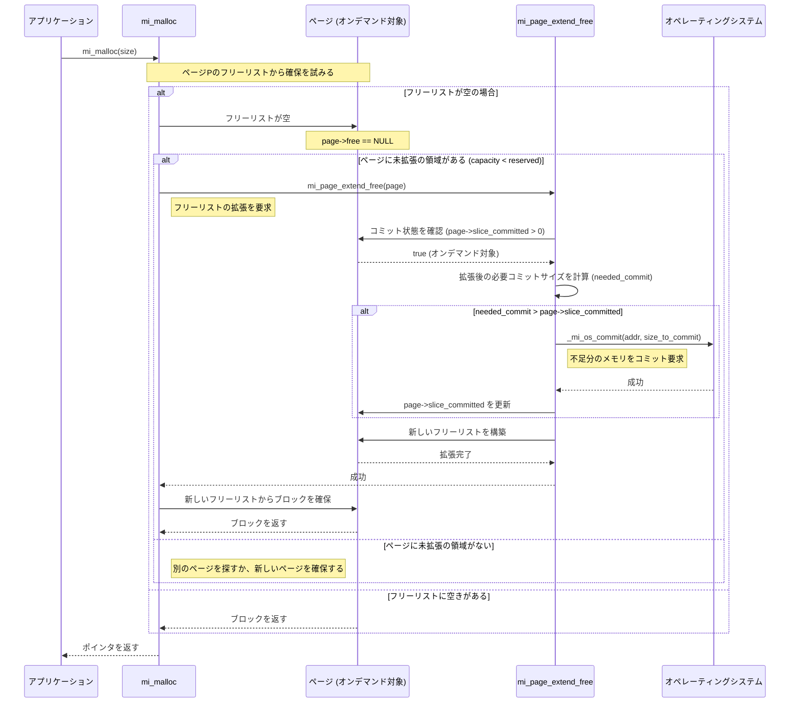

### ページ内フリーリスト拡張とオンデマンドコミット

#### 設計思想：遅延コミットによるメモリ効率の最大化

-   **課題**: 新しいページを確保した際、そのページ内の全ブロック領域（最大で`MI_LARGE_PAGE_SIZE`、通常2MiB）を即座にコミットすると、アプリケーションがそのページを少ししか使わなかった場合に物理メモリの無駄が生じます。
-   **解決策**: `mi_option_page_commit_on_demand` オプションが有効な場合（デフォルトではLinuxのようなオーバーコミットOS以外で有効）、mimallocはページ確保時に物理メモリを一切コミットしないか、ごく一部だけをコミットします。そして、実際にアロケーションが発生し、ページ内の未使用領域からフリーリストを拡張する必要が生じたときに、**初めてその拡張に必要な分だけ**を段階的にコミットします。

これにより、アプリケーションが実際に使用した分に近い物理メモリしか消費しないため、メモリ使用効率が大幅に向上します。

#### 実装のキーポイント

-   **`slice_committed` フィールド**: `mi_page_t` 構造体には `slice_committed` というフィールドがあります。この値が `0` でない場合、そのページがオンデマンドコミットの対象であることを示します。このフィールドは、ページ内で現在コミット済みのバイト数を保持します。
-   **`mi_page_extend_free`**: この関数は、ページのフリーリストが枯渇した際に、ページの予約済みだがまだ使われていない領域（`reserved` - `capacity`）から新しいフリーブロックを生成し、リストに追加する役割を担います。オンデマンドコミットのロジックは、この関数の中核部分に実装されています。
-   **段階的なコミット**: コミットは、`MI_PAGE_MIN_COMMIT_SIZE`（通常、OSのページサイズ、4KiB）の倍数で行われます。フリーリストを少し拡張するだけなら、最小限のコミットで済みます。

### 動作シーケンス

アプリケーションからの `mi_malloc` 呼び出しがきっかけで、ページのフリーリストが枯渇し、オンデマンドコミットが発生するまでの流れを以下に示します。



### ソースコード解説 (`src/page.c`)

この機能の中心である `mi_page_extend_free` 関数の該当部分を以下に示します。

```c
// src/page.c

// Extend the capacity (up to reserved) by initializing a free list
static bool mi_page_extend_free(mi_heap_t* heap, mi_page_t* page) {
  // ... (事前チェック)

  // ... (拡張するブロック数を計算)
  size_t extend = (size_t)page->reserved - page->capacity;
  // ... (extend のサイズを調整)

  //
  // ここからがオンデマンドコミットの核心部分
  //
  // page->slice_committed が 0 より大きい場合、このページはオンデマンドコミットの対象
  if (page->slice_committed > 0) {
    // 拡張後のフリーリストが占める総バイト数を計算
    const size_t needed_size = (page->capacity + extend)*bsize;
    
    // その総バイト数をカバーするために必要なコミットサイズを計算
    // MI_PAGE_MIN_COMMIT_SIZE (通常4KiB) 単位で切り上げる
    const size_t needed_commit = _mi_align_up( mi_page_slice_offset_of(page, needed_size), MI_PAGE_MIN_COMMIT_SIZE );
    
    // 必要なコミットサイズが、現在のコミット済みサイズを超えているかチェック
    if (needed_commit > page->slice_committed) {
      // 不足分をOSにコミットするように要求
      // mi_page_slice_start(page) はページのコミット可能な領域の開始アドレスを返す
      if (!_mi_os_commit(mi_page_slice_start(page) + page->slice_committed, 
                         needed_commit - page->slice_committed, 
                         NULL)) 
      {
        return false; // OSコミット失敗
      }
      // コミット済みサイズを更新
      page->slice_committed = needed_commit;
    }
  }

  // コミットが完了した後、実際にフリーリストを構築する
  if (extend < MI_MIN_SLICES || MI_SECURE<3) {
    mi_page_free_list_extend(page, bsize, extend, &heap->tld->stats );
  }
  else {
    mi_page_free_list_extend_secure(heap, page, bsize, extend, &heap->tld->stats);
  }
  
  // ページの容量 (capacity) を更新
  page->capacity += (uint16_t)extend;
  // ...
  return true;
}
```

この設計により、mimallocは物理メモリの消費を必要最小限に抑えつつ、アプリケーションからの要求に応じて動的にメモリを提供することができます。これは、特に長期間実行され、メモリ使用量の変動が激しいアプリケーションにおいて、メモリフットプリントを低く保つ上で非常に効果的です。