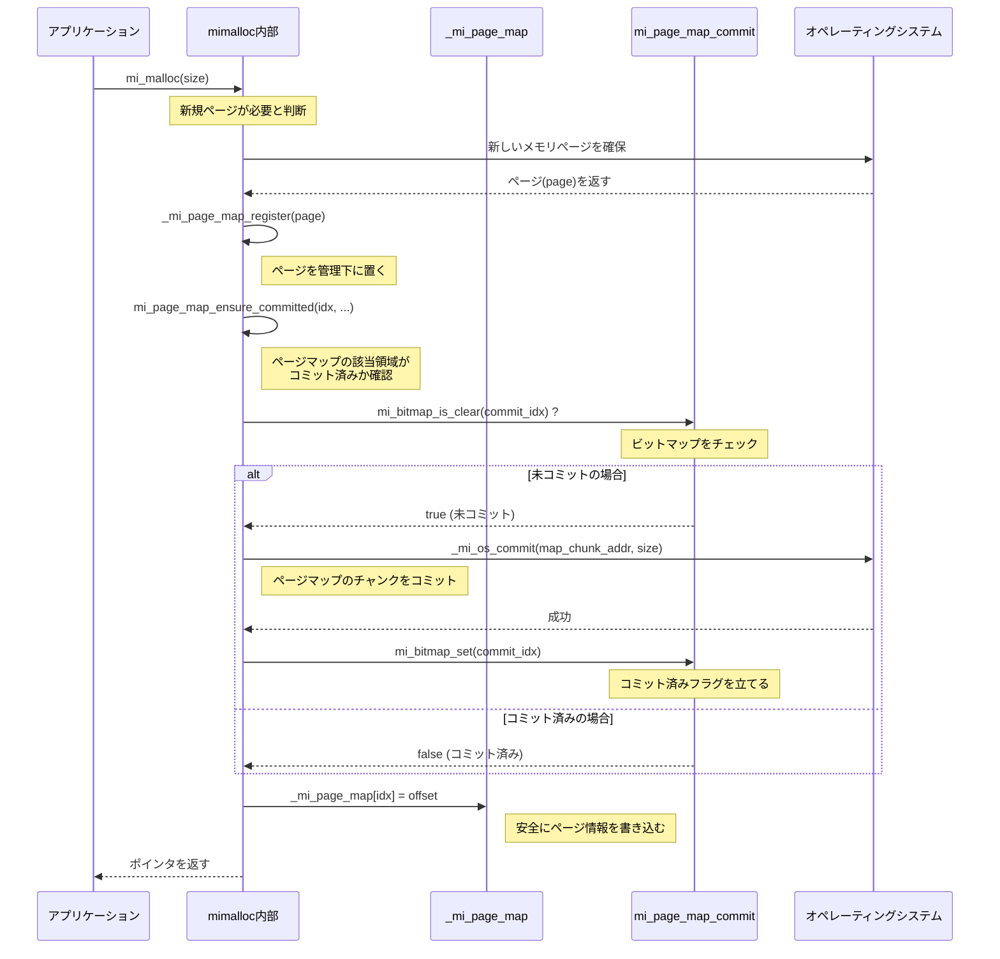
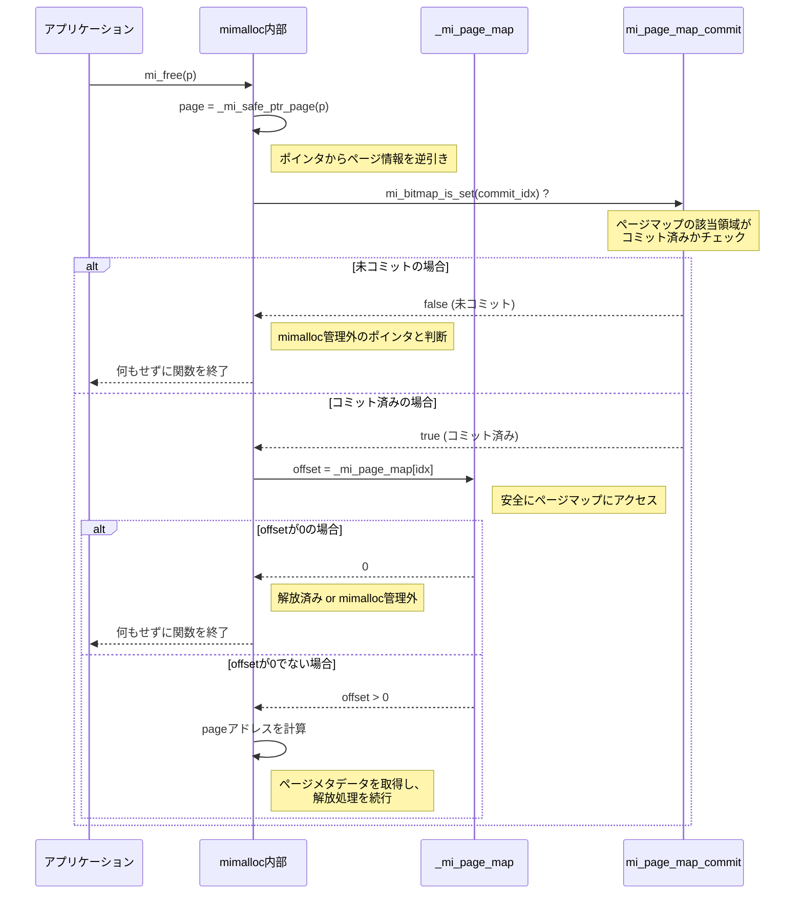

### mimallocのページマップ・コミット戦略解説

mimallocは、ポインタからそれが属するメモリページ（`mi_page_t`）のメタデータを高速に逆引きするため、「ページマップ」という巨大なルックアップテーブルを利用します。特に64-bit環境では、このページマップがカバーする仮想アドレス空間は広大（最大128TiB以上）であり、その管理方法が性能とメモリ効率の鍵となります。

`mi_option_pagemap_commit`オプションは、この巨大なページマップにいつ物理メモリを割り当てる（コミットする）かを制御します。

#### 設計思想：オンデマンドコミットによる効率化

-   **課題**: 64-bitの広大なアドレス空間全体に対応するページマップ（最大数GiB）をプロセス起動時に一括でコミットすると、膨大な物理メモリを消費し、起動時間が大幅に悪化します。
-   **解決策**: デフォルト設定（`mi_option_pagemap_commit=0`）では、ページマップ用の仮想アドレス空間を**予約（reserve）**するだけに留め、物理メモリの割り当て（**コミット, commit**）は、その領域が実際に必要になったときに**オンデマンド**で行います。

これにより、アプリケーションが実際に使用するアドレス範囲に対応する部分だけが物理メモリを消費するため、起動が高速でメモリフットプリントを劇的に削減できます。

#### 実装：コミット状態を追跡するビットマップ

オンデマンドコミットを実現するため、mimallocは以下の巧妙な実装を用いています。

1.  **`_mi_page_map`**: ページマップ本体。巨大なバイト配列で、仮想アドレス空間を64KiBのスライス単位でマッピングします。最初は予約されているだけで、ほとんどコミットされていません。
2.  **`mi_page_map_commit`**: `_mi_page_map`自体のコミット状態を管理するための、もう一段階上のビットマップです。このビットマップの各ビットが、`_mi_page_map`の大きなチャンク（例: 64KiB分のエントリ）に対応します。これにより、どの部分がコミット済みかを非常に効率的に追跡できます。

### 動作シーケンス

以下に、新しいメモリページが確保され、ページマップに登録される際の関数の呼び出しシーケンスと、`mi_free`時にポインタからページを安全に逆引きするシーケンスを図解します。

#### 1. 新規ページ確保とページマップへの登録

アプリケーションがメモリを要求し、mimallocが新しいページをOSから確保した後、そのページを内部的に管理するためにページマップへ登録する際のフローです。

#### 2. メモリ解放時の安全なポインタ逆引き

`mi_free`が呼ばれた際、渡されたポインタが本当にmimallocが管理するものか、安全かつ高速に確認するためのフローです。

このオンデマンドコミット戦略により、mimallocは広大な64-bitアドレス空間を効率的に利用しつつ、起動時のオーバーヘッドとメモリフットプリントを最小限に抑えるという、相反する要求を両立させています。